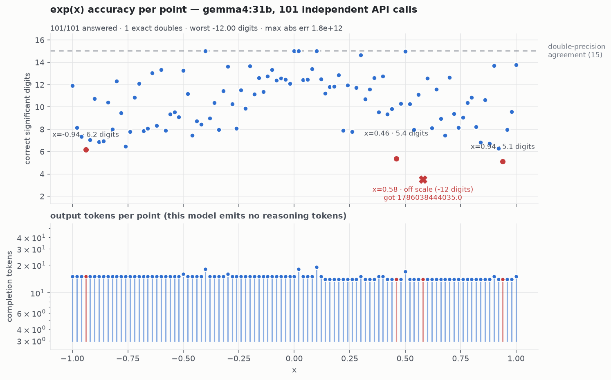

# LLM-Tests — how many correct digits does an LLM actually produce?

Small, reproducible harness that asks a model for the value of an elementary function — **one
stateless API call per point, no tools, no code execution, no conversation** — and scores the reply
by how many significant digits agree with IEEE-754 double precision.

The metric is `correct digits = -log10(relative error)`, capped at 15. Pass/fail hides everything
interesting here; "4.8 digits" and "15 digits" are both "wrong" to a boolean grader.

Stdlib Python only. Works against any OpenAI-compatible endpoint — hosted or a local
llama.cpp/SGLang/vLLM/Ollama server.


Four runs of the same function, the same 101 points and the same prompt. Top row: one model on
arguments it can recall, then on arguments it cannot — the same model loses six digits. Bottom row:
a reasoning model that derives every value instead, and what happens when you throttle its
thinking. Regenerate with `.venv-plot/bin/python make_hero_figure.py [--dark]`.

## The two tests

| | grid | question it answers |
|---|---|---|
| **test1** | `x = -1.00 … 1.00` step `0.02` (101 round arguments) | how accurate is the model on values it may have memorised? |
| **test1v2** | the same 101 points, each nudged by a deterministic ~10-decimal offset (`-0.9513299347`, …) | how accurate is it when the argument **cannot** be in any training corpus? |

test1v2 also supports `--func exp|sin|cos|log|sqrt`.

## Headline results (2026-08, temperature 0, 101 points per cell)

**Round arguments (test1, `exp`):**

| | gemma4:31b | DeepSeek-V4-Flash | GLM-5.2 |
|---|---|---|---|
| median correct digits | 10.40 | 15.00 | 15.00 |
| worst point | **−12.0** | 6.18 | 8.44 |
| exact doubles | 1 | 30 | 34 |
| unanswered | 0 | 1 | 2 |
| completion tokens | 1,491 | 979,136 | 1,926,343 |
| wall @ concurrency 8 | 22s | 916s | 4,288s |

gemma4's worst point is not a rounding error: asked for `exp(0.58)` it replied `1786038444035` —
**the decimal point is missing**, so the answer is off by a factor of 10¹² while looking perfectly
well-formed.



The lower panel of every per-run figure shows the tokens spent on each point. gemma4 emits ~14 per
answer and no reasoning at all — it is recalling, not computing, and the accuracy scatter reflects
that.

**Recall-proof arguments (test1v2)** — 36 runs, 17 models, 6 endpoints, sorted by median accuracy:

| model | fn | answered | median | worst | tokens | cost | notes |
|---|---|---|---|---|---|---|---|
| anthropic/claude-opus-4.7 | exp | 2/10 | **15.00** | 15.00 | 279,493 | $6.99 | effort=high, cap 32k |
| openai/gpt-5.6-sol | sin | 5/5 | **15.00** | 14.31 | 22,205 | $0.67 |  |
| openai/gpt-5.6-sol | exp | 5/5 | **15.00** | 14.17 | 21,271 | $0.64 |  |
| anthropic/claude-opus-5 | exp | 10/10 | **15.00** | 13.38 | 166,881 | $4.17 |  |
| deepseek-v4-flash | exp | 54/101 | **15.00** | 13.17 | 5,221,157 | $1.46 |  |
| deepseek-v4-flash | sin | 39/101 | **15.00** | 11.05 | 5,904,512 | $1.65 |  |
| z-ai/glm-5.2 | exp | 3/21 | **15.00** | 9.41 | 1,301,405 | $3.15 |  |
| glm-5.2 | exp | 18/101 | **15.00** | 8.37 | 3,048,291 | free |  |
| openai/gpt-5.6-sol-pro | exp | 5/5 | **15.00** | 6.18 | 69,237 | $2.08 |  |
| Claude Opus 5 (CLI) | exp | 20/20 | **15.00** | 5.56 | 313,793 | sub | effort=max |
| deepseek-v4-flash | exp | 98/101 | **15.00** | 5.04 | 2,678,556 | $0.75 | effort=low |
| Claude Opus 5 (CLI) | sin | 20/20 | **15.00** | 3.43 | 327,260 | sub | effort=max |
| Claude Opus 5 (CLI) | exp | 21/21 | **14.87** | 4.33 | 80,758 | sub |  |
| Claude Fable 5 (CLI) | exp | 62/101 | **14.68** | 10.49 | 555,843 | sub |  |
| Claude Fable 5 (CLI) | exp | 20/20 | **14.43** | 11.78 | 181,633 | sub |  |
| deepseek-v4-flash | sin | 98/101 | **14.38** | -0.30 | 3,003,926 | $0.84 | effort=low |
| Claude Opus 5 (CLI) | sin | 101/101 | **14.38** | 8.32 | 800,352 | sub |  |
| Claude Opus 5 (CLI) | exp | 101/101 | **14.37** | 3.88 | 566,897 | sub |  |
| Claude Fable 5 (CLI) | sin | 20/20 | **14.23** | 3.77 | 211,897 | sub |  |
| nvidia/nemotron-3-super-120b-a12b | exp | 8/101 | **12.71** | 2.98 | 79,109 | free |  |
| anthropic/claude-sonnet-5 | exp | 10/10 | **11.98** | 9.30 | 226,295 | $2.26 |  |
| anthropic/claude-opus-4.8 | exp | 10/10 | **11.04** | 9.20 | 41,409 | $1.04 | effort=high, cap 32k |
| gpt-oss:120b | exp | 98/101 | **9.44** | 3.18 | 919,632 | free |  |
| anthropic/claude-opus-4.6 | exp | 10/10 | **6.93** | 3.70 | 10,549 | $0.26 |  |
| gpt-oss:20b | exp | 93/101 | **6.37** | 2.44 | 2,668,420 | free |  |
| qwen/qwen3.7-flash | sin | 69/101 | **6.06** | 3.15 | 1,931,809 | $0.25 |  |
| qwen/qwen3.7-flash | exp | 80/101 | **5.61** | 2.84 | 2,785,476 | $0.36 |  |
| qwen3.5:397b | exp | 101/101 | **5.37** | 3.49 | 653,567 | free |  |
| Claude Haiku 4.5 (CLI) | exp | 20/20 | **4.91** | 2.47 | 215,964 | sub |  |
| gpt-oss:120b | exp | 101/101 | **4.83** | 3.18 | 47,723 | free | effort=low |
| gemma4:31b | exp | 101/101 | **4.76** | 2.97 | 1,804 | free |  |
| anthropic/claude-opus-4.8 | exp | 10/10 | **4.61** | 4.02 | 90 | $0.00 |  |
| anthropic/claude-opus-4.7 | exp | 10/10 | **4.46** | 3.57 | 553 | $0.01 |  |
| Claude Opus 4.8 (CLI) | exp | 101/101 | **4.46** | 2.50 | 13,109 | sub |  |
| Claude Opus 4.8 (CLI) | exp | 101/101 | **4.44** | 2.92 | 3,370 | sub | --effort high (no-op on 4.8) |
| gemma4:31b | sin | 101/101 | **4.09** | 2.43 | 1,880 | free |  |

`sub` = Claude Code subscription usage (not a per-token bill). `free` = Ollama Cloud free tier.
Sampled runs (`n/10`, `n/20`, `n/5`) use `--sample`, a deterministic subset of the same grid, so
every model is scored on identical arguments.

### Cost per correct answer

Median accuracy alone hides an order-of-magnitude spread in what a correct digit costs:

| model | $ per 101-point grid | answered | ≥12 digits | **$ per 12-digit point** |
|---|---|---|---|---|
| **DeepSeek-V4-Flash, `effort=low`** | **$0.75** | 98/101 | 82 | **$0.009** |
| DeepSeek-V4-Flash, default | $1.46 | 54/101 | 54 | $0.027 |
| gpt-5.6-sol | ~$12.93 | 5/5 | 5 | $0.128 |
| Claude Opus 5 (OpenRouter) | ~$42.12 | 10/10 | 10 | $0.417 |
| Claude Sonnet 5 | ~$22.83 | 10/10 | 5 | $0.452 |
| Claude Opus 4.8, `effort=high` | ~$10.50 | 10/10 | 2 | $0.520 |

**DeepSeek-V4-Flash at `effort=low` is the standout: a 12-significant-digit answer for about one
cent, ~14x cheaper than the next best and ~46x cheaper than Opus 5 for the same median.** Two
caveats keep it from being a blanket recommendation: at default effort it exhausts its output
budget on 46% of points, and at low effort it produced the study's most dangerous artifact — a
`sin` value correct to eleven digits **with the wrong sign**.

Three findings the round-argument grid could not have shown:

1. **gemma4 loses ~6 digits when it cannot recall.** Median 10.40 → 4.76; points reaching 9+ digits
   fall from 67/101 to 1/101. Same model, same prompt, same ~18 tokens per answer. Its test1 score
   was a lookup table almost in full.
2. **DeepSeek gets *more* accurate and stops finishing.** Worst case improves 6.18 → 13.17 digits,
   because with nothing to recall it derives every value (argument splitting + Taylor series,
   cross-checked — one trace is 46,000 characters of long multiplication for a single point). But
   47 of 101 calls exhaust the 65,536-token output limit mid-arithmetic and return **empty**.
3. **Throttling the thinking trades silence for silent errors.** `reasoning_effort=low` lifts the
   answered rate 54 → 98 at half the cost, median still 15 digits — but the tail collapses. The
   worst `sin` point came back as `+0.5423228246946903` where the answer is `-0.54232282470165383`:
   **eleven correct digits with the sign flipped.**


*Unbounded thinking.* Every answered point sits on the double-precision line; the red row along the
bottom is the 47 calls that never produced one, and the lower panel shows why — they are pinned
against the 65,536-token output cap.


*Throttled thinking.* Same model, same grid: the token panel drops off the cap and nearly every
point now returns — at the cost of a spray of answers falling to 5–12 digits.


### Two findings from the wider model sweep

**Thinking volume does not buy digits — method does.** `qwen3.5:397b` spends ~6.5k tokens per
point reasoning and lands at **5.37** digits; `gpt-oss:120b` at `effort=low` spends ~470 and lands
at **4.83**. Fourteen times the thinking buys half a digit. What separates the 15-digit models is
*what* they do (argument splitting + series, cross-checked) rather than how long they do it.

**The same model differs by host.** Claude Opus 5 through the Claude Code CLI averages ~3.8k
tokens/point and bottoms out at 4.33 digits; through OpenRouter it averages ~16.7k and bottoms out
at 13.38. Same weights, ~4.4× the thinking, and the difference lands entirely in the tail — the
hosting configuration is part of the measurement, not a detail.

**Shortcut answers are where every model fails.** The worst point of almost every run is also its
cheapest: DeepSeek's 6.18-digit answer took 128 tokens, GLM's 3.29-digit answer took 13, and Claude
Opus 5's 4.33-digit answer took **9**. A model that decides not to derive is a model about to be
wrong, at every tier.

### What the wider sweep added

**Model size and thinking budget are different axes, and neither predicts precision.**
The cleanest controlled pair is `gpt-oss` on one host: the **120b** scores 9.44 median on ~9k
tokens/point, the **20b** scores **6.37 on ~28.7k** — the smaller model spends 3x more to land 3
digits lower. It does not think less; it flails. The same shape appears across vendors: Claude
Haiku 4.5 spends *more* per point than Claude Fable 5 (10.8k vs 9.1k) and lands **ten digits**
lower (4.94 vs 14.44).

**Effort raises the median and does not fix the tail.** Claude Opus 5 at `--effort max` reaches a
clean 15.00 median on both functions, but its worst point stays broken — 5.56 digits on `exp`, and
on `sin` the floor actually *drops* (8.32 at default effort, 3.43 at max). Across every model,
tier, vendor and effort setting measured here, the worst answer is almost always the cheapest one,
and nothing tested eliminates it.

**Median accuracy is a model property; the tail is not.** Claude Fable 5 has the best tail measured
anywhere (10.49 worst over 62 answered `exp` points) and still shortcuts to 3.77 on `sin`.

**API defaults dominate small-model-vs-large-model differences.** Opus 4.7/4.8 do not think unless
asked: at their default they answer in 9-130 tokens and score ~4.5 digits, indistinguishable from
gemma4. Given `reasoning_effort` *and* a `max_tokens` cap, 4.8 reaches 11.04. The real 4.8-to-5 gap
is ~4 digits, not the ~10 a naive default-settings comparison suggests.

**Endpoint behaviour is part of the measurement.** The same Claude Opus 5 spends ~3x more tokens
through OpenRouter than through the Claude Code CLI and has a much better tail (13.38 vs 3.88).
Output caps decide what is even measurable: GLM-5.2 needs ~80k tokens/point and returns nothing
under OpenRouter's 65,536 ceiling. And NVIDIA NIM answered **8 of 101** points over 8.3 hours, the
rest `HTTP 504` — an endpoint result, not a model result.

**Capped runaways are the expensive failure mode.** An uncapped `effort=high` sweep on Opus 4.6
billed 655,360 tokens for **zero** answers. Always pass `--max-tokens` on a paid endpoint: the same
model, same effort, with a 32k cap finished in 6,849 tokens and answered.

No configuration gives "always answers and always correct": no thinking → always answers, never
accurate; unbounded thinking → exact or silent; throttled thinking → occasionally, quietly wrong.

## Run it

```bash
# hosted
DEEPSEEK_API_KEY=sk-... ./test1/run_test1.py --model deepseek-v4-flash
DEEPSEEK_API_KEY=sk-... ./test1v2/run_test1v2.py --func sin --model deepseek-v4-flash \
    --reasoning-effort low

OLLAMA_API_KEY=... ./test1v2/run_test1v2.py --func exp --base-url https://ollama.com/v1 \
    --model gemma4:31b --api-key-env OLLAMA_API_KEY

# local OpenAI-compatible server
./test1v2/run_test1v2.py --func exp --base-url http://127.0.0.1:8090/v1 --model qwen3.6 \
    --api-key dummy
```

```bash
# Claude Code CLI backend — no API key; zero tools, no CLAUDE.md loaded
./test1v2/run_test1v2.py --api claude-cli --func exp

# native Anthropic Messages API (adaptive thinking, summarized reasoning)
ANTHROPIC_API_KEY=sk-ant-... ./test1v2/run_test1v2.py --api anthropic --model claude-opus-5

# any aggregator; --sample runs a deterministic subset of the same grid
OPENROUTER_API_KEY=sk-or-v1-... ./test1v2/run_test1v2.py \
    --base-url https://openrouter.ai/api/v1 --model anthropic/claude-opus-5 \
    --api-key-env OPENROUTER_API_KEY --sample 10 --no-temperature
```

Three backends, selected with `--api`:

| `--api` | wire protocol | credentials |
|---|---|---|
| `openai` (default) | `POST {base}/chat/completions` | bearer token from `--api-key-env` |
| `anthropic` | `POST {base}/v1/messages`, adaptive thinking, `output_config.effort` | `ANTHROPIC_API_KEY` |
| `claude-cli` | execs `claude -p` with `--tools ""` and a throwaway `$HOME`/cwd | the machine's Claude Code login |

The `claude-cli` backend is the isolation-sensitive one: `--tools ""` disables the entire built-in
tool set (otherwise the model just computes the answer with `python`), and the throwaway `$HOME`
plus empty working directory keep every `CLAUDE.md` — user and project — out of the context.

Keys are read from the environment only — nothing is stored in the repo.

Useful flags: `--concurrency`, `--temperature`, `--reasoning-effort low|medium|high|max|none`,
`--max-tokens`, `--timeout`, `--retries`, `--lo/--hi/--step`, `--seed`, `--tag`.

## Plots

```bash
python3 -m venv .venv-plot && .venv-plot/bin/pip install matplotlib   # once
.venv-plot/bin/python test1/plot_results.py test1v2/results/<tag> [--dark]
```
Three figures per run: accuracy per point (with a second panel showing tokens spent on the same
point), the digit histogram, and effort vs accuracy. Light and dark variants.

## Output layout

```
test1[v2]/results/<tag>/
  raw.jsonl      one line per point: reply, full reasoning trace, usage, latency
  results.csv    x, expected, got, abs_err, rel_err, correct_digits, tokens
  summary.json   every metric, plus the exact prompts and run metadata
  plots/         rendered figures
  REPORT.md      written up per run (where present)
```

`test1/analysis/` holds a reasoning-trace study: what the model actually *does* inside the thinking
block (method markers, self-checks, doubt markers, and their correlation with accuracy), plus
verbatim traces of the least accurate points.

## Method notes

- temperature 0; one stateless request per point; no tools; no shared context
- reference values from Python `math` (correctly rounded doubles, < 1 ulp)
- a reply with no parseable number is recorded as a failure, never as a wrong value
- n = 1 per point per model; single function family; results are per-model-version and dated
- test1v2 also strengthened the digit request from "≥12" to "≥15, do not truncate" — recorded in
  `summary.json:meta` so the ablation is not silently confounded (in test1, "at least 12
  significant digits" made DeepSeek truncate an exact answer down to 12 digits)

## Prior work

Related but, as far as I found, not the same experiment: numerical-perturbation robustness studies
(ACL 2025), integer-arithmetic memorisation-vs-computation work (arXiv 2308.01154, 2504.05262,
2402.17709), and classical ULP error analyses of libm implementations. This combines transcendental
functions, digit-level grading on a dense grid, and a round-vs-recall-proof ablation. If it has been
done before, please point me at it.
