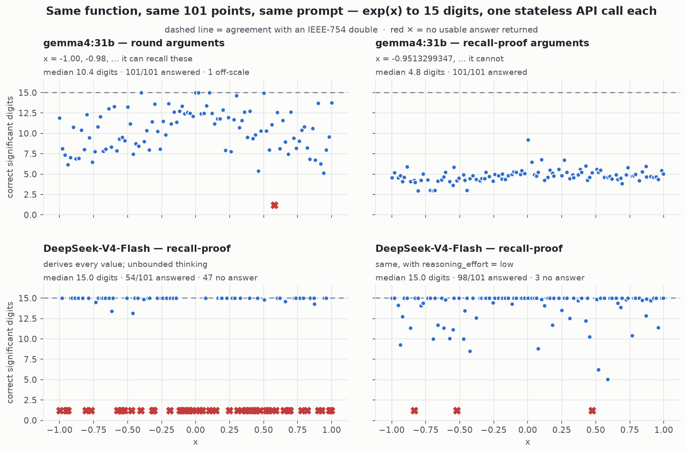
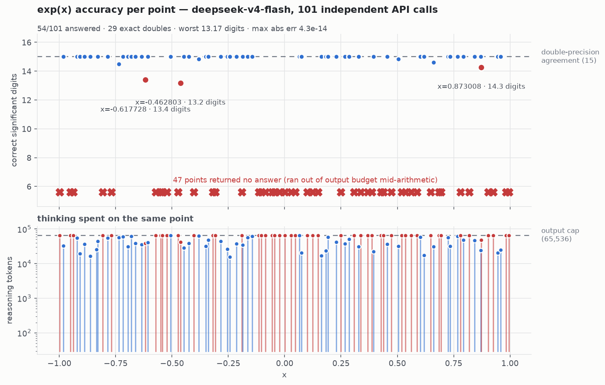
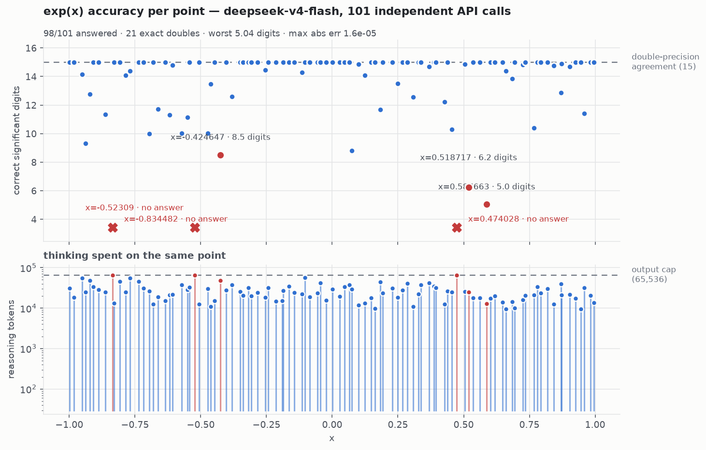

# Can an LLM follow a derivation — or does it just reach for a calculator?

Ask any assistant for `exp(-0.9513299347)` to 15 digits and you get a perfect answer. It writes
three lines of Python and runs them. **That measures the sandbox, not the model.**

This is the same exam with the calculator taken away. No tools are available — not restricted, not
discouraged, *absent* — so the model has to do what a student does on a closed-book paper: reduce
the argument onto a constant it remembers, expand a Taylor series, and work through a dozen
16-digit multiplications by hand. Thousands of tokens of arithmetic in which **one slipped carry
destroys the answer**.

There is no way to bluff it. The reply is either right to fifteen places or it isn't, and the
grader can tell to a fraction of a digit.

> **We are not testing whether a model can produce the right number.**
> **We are testing whether it can follow a long derivation without losing the thread.**
> With a tool, every model scores 100%. Without one, the spread is enormous.

---

## The headline

**100+ runs · 50+ models · 8 endpoints · one prompt · one stateless call per point.**

Asked the identical question, models split into two populations with almost nothing in between:

| | tokens per point | correct digits | example |
|---|---|---|---|
| **Derivers** | ~24,000 | **13 – 15** | DeepSeek-V4-Flash, GPT-5.5, Kimi-K2.6 |
| **Shortcutters** | **~18** | **3 – 5** | Mistral-Large-3 (675B), gemma4, GPT-4.1 |

A 1,300× difference in effort, and a 10-digit difference in the answer.

**And which side a model lands on is not predicted by its size, its vendor, or its price.**
Mistral shortcuts at 24B *and* at 675B. Poolside's *smaller* model beats its larger sibling.
And OpenAI's own ladder crosses the line in **a single version step** — GPT-4.1 through 5.4 all
shortcut at ~10 tokens; GPT-5.5 derives at 8,201.



*Four runs, same function, same 101 points, same prompt. Top: one model on arguments it can recall,
then on arguments it cannot — six digits vanish. Bottom: a model that derives every value, and what
happens when you throttle its thinking.*

---

## Why this task

- **Unfakeable.** A confident paragraph earns nothing. Only correct digits score.
- **Gradable to a fraction of a digit**, against a reference correct by construction.
- **Recall-proof on demand.** Arguments are jittered to ten decimals by a seeded hash, so they
  cannot appear in any training corpus. The model must derive, or guess.
- **It separates what every other eval conflates:** *knowing* the method, and *executing* it
  without error across thousands of tokens.

The metric is `correct digits = -log10(relative error)`, capped at 15 (IEEE-754 double agreement).
Pass/fail would hide everything interesting — "4.8 digits" and "15 digits" are both "wrong" to a
boolean grader.

### How "no calculator" is enforced

Over a plain API this is free: no `tools` array is sent, so there is nothing to call. The risky path
is the Claude Code CLI backend, where the model normally *has* an interpreter. There it runs with:

- `--tools ""` — the entire built-in tool set disabled,
- a throwaway `$HOME` and empty working directory, so no `CLAUDE.md` reaches the context,
- and every reply verified to have **`num_turns == 1`** — a tool call needs a second turn, so a
  single turn proves the answer came out of the model, not out of `python`.

---

## The two tests

| | grid | question it answers |
|---|---|---|
| **test1** | `x = -1.00 … 1.00` step `0.02` (101 round arguments) | how accurate on values it may have **memorised**? |
| **test1v2** | same 101 points, each nudged by a deterministic ~10-decimal offset (`-0.9513299347`, …) | how accurate when the argument **cannot** be in any corpus? |

`test1v2` supports `--func exp|sin|cos|log|sqrt`.

The ablation between them is the point. **gemma4:31b scores 10.40 median on round arguments and
4.76 on recall-proof ones** — same model, same prompt, same ~18 tokens per answer. Its test1 score
was a lookup table almost in full.

Its worst round-argument point is not a rounding error: asked for `exp(0.58)` it replied
`1786038444035` — **the decimal point is missing**, so the answer is off by 10¹² while looking
perfectly well-formed.

---

## Results

Sorted into the four groups that actually behave differently. Read `tok/pt` alongside the median —
it says whether the model **derived** the answer or **recalled** it.

### 1 — Derivers · thousands of tokens, land on the double-precision line

| model | fn | answered | median | worst | tok/pt | cost |
|---|---|---|---|---|---|---|
| **openai/gpt-5.5** | exp | **101/101** | **15.00** | 3.08 | 8,201 | — |
| **openai/gpt-5.5** | sin | 20/20 | **15.00** | **12.18** | 9,344 | — |
| openai/gpt-5.6-sol | exp | 5/5 | **15.00** | 14.17 | 4,254 | $0.64 |
| anthropic/claude-opus-5 | exp | 10/10 | **15.00** | 13.38 | 16,688 | $4.17 |
| deepseek-v4-flash | exp | 54/101 | **15.00** | 13.17 | 51,695 | $1.46 |
| **deepseek-v4-flash `effort=low`** | exp | **98/101** | **15.00** | 5.04 | 26,520 | **$0.75** |
| Claude Opus 5 (CLI) `effort=max` | exp | 20/20 | **15.00** | 5.56 | 15,690 | sub |
| z-ai/glm-5.2 | exp | 18/101 | **15.00** | 8.37 | 30,181 | free |
| Claude Fable 5 (CLI) | exp | 62/101 | **14.68** | 10.49 | 5,503 | sub |
| **moonshotai/kimi-k2.7-code** | exp | 7/20 | **15.00** | **12.14** | 55,391 | free |
| Claude Opus 5 (CLI) | sin | 101/101 | **14.38** | 8.32 | 7,924 | sub |
| **moonshotai/kimi-k2.6** | sin | 15/20 | **14.14** | 7.89 | 54,103 | free |
| **moonshotai/kimi-k2.6** | exp | 13/20 | **13.68** | 8.31 | 57,209 | free |

### 2 — The sparse middle · genuinely derive, still fall short

| model | fn | answered | median | worst | tok/pt |
|---|---|---|---|---|---|
| anthropic/claude-sonnet-5 | exp | 10/10 | 12.10 | 9.30 | 22,630 |
| **openai/o3** | exp | 1/3 | 11.88 | 11.88 | 31,987 |
| **meta/muse-glimmer-30b** | exp | 3/3 | 11.46 | 9.82 | 27,817 |
| **deepseek-v4-flash:preview** | exp | 3/3 | 11.44 | 9.50 | 49,470 |
| **qwen/qwen3.7-max** | exp | 3/3 | 11.40 | 11.32 | 11,843 |
| anthropic/claude-opus-4.8 `effort=high` | exp | 10/10 | 11.13 | 9.20 | 4,141 |
| **openai/o4-mini** | exp | 3/3 | 10.96 | 9.82 | 15,557 |
| **thinkingmachines/inkling-small** | exp | 3/3 | 10.01 | 6.18 | 25,808 |
| gpt-oss:120b | exp | 98/101 | 9.55 | 3.18 | 9,105 |
| **google/gemini-3.5-flash** | exp | 20/20 | 9.24 | 6.14 | 22,401 |
| poolside/laguna-xs-2.1 | exp | 61/101 | 7.60 | 3.08 | 25,599 |
| gpt-oss:20b | exp | 93/101 | 6.37 | 2.44 | 26,420 |
| **anthropic/claude-sonnet-4-6** (near.ai) | exp | 3/3 | 6.33 | 4.76 | 1,292 |
| qwen/qwen3.7-flash | exp | 80/101 | 5.63 | 2.84 | 27,579 |
| **qwen3.5:397b** | exp | **101/101** | 5.19 | 3.95 | 6,015 |
| **nvidia/nemotron-3-ultra** (Ollama) | exp | 3/3 | 4.50 | 4.13 | 12,894 |
| **openai/o3-mini** | exp | 3/3 | 3.91 | 2.96 | 4,588 |

### 3 — Shortcutters · ~18 tokens, 3–5 digits, never fail and never improve

| model | size | answered | median | tok/pt |
|---|---|---|---|---|
| google/gemini-2.5-pro | — | 3/3 | 5.23 | 22 |
| google/gemma-4-26b-a4b (MoE) | 26B | 3/3 | 4.91 | 19 |
| gemma4:31b (dense) | 31B | 101/101 | 4.76 | 18 |
| anthropic/claude-opus-4.8 (default) | — | 10/10 | 4.66 | **9** |
| upstage/solar-pro4 | — | 101/101 | 4.41 | 18 |
| openai/gpt-5.4 | — | 3/3 | 4.38 | 11 |
| **mistral-large-3:675b** | **675B** | 101/101 | 4.29 | 18 |
| openai/gpt-5.2 | — | 3/3 | 4.22 | 10 |
| poolside/laguna-s-2.1 | — | 20/101 | 4.13 | 18 *(when it answers)* |
| openai/gpt-5.1 | — | 3/3 | 4.03 | 16 |
| qwen3-coder | ~30B | 101/101 | 3.72 | 18 |
| openai/gpt-4.1 | — | 3/3 | 3.57 | **7** |
| **devstral:24b** | **24B** | 101/101 | 3.46 | 16 |
| openai/gpt-5.4-mini | — | 3/3 | 3.40 | 16 |
| qwen2.5-coder:14b | 14B | 101/101 | 2.93 | 18 |

### 4 — Never finish · reason to the output cap, return empty content

| model | answered | tok/pt | endpoint |
|---|---|---|---|
| minimax-m3 | 0/101 | 32,000 (cap) | Ollama Cloud |
| minimax-m2.7 | 0/20 | 65,536 (cap) | Ollama Cloud |
| inclusionai/ling-3.0-tiny | 0/101 | 27,564 | OpenRouter |
| inclusionai/ling-3.0-flash | 0/3 | 32,000 (cap) | OpenRouter |
| cohere/north-mini-code | 0/3 | 26,176 | OpenRouter |
| deepseek-v4-pro | 0/3 | 65,536 (cap) | Ollama Cloud |
| glm-5.1 | 0/3 | 32,768 (cap) | Ollama Cloud |
| claude-opus-4.6 `effort=high`, uncapped | 0/10 | 65,536 (cap) | OpenRouter |

**And one category of its own — the Nemotron family is broken on this task at every size.**
`nemotron-3-nano-30b` scored a median of **0.00** correct digits over 101 points (one reply was
`229144000.0` where the answer is `0.89`); `nemotron-3-ultra-550b` managed 3.69; the
*reasoning-tuned* `nemotron-3-nano-omni-30b` scored **−0.00** after burning 32,768 tokens per
point. Three models, three sizes, two endpoints, one result.

`sub` = Claude Code subscription (not a per-token bill) · `free` = Ollama Cloud free tier.
Sampled runs (`n/3`, `n/20`) use `--sample`, a deterministic subset of the same grid, so every
model is scored on identical arguments.

> ⚠ **Two measurement traps this harness now handles — both found the hard way.**
>
> **1. Thinking tokens can hide in `total_tokens`.** near.ai serving Gemini returns
> `prompt 113 · completion 18 · total 15126` — **99.9% of the spend is in neither
> `completion_tokens` nor `reasoning_tokens`**, only in the total. Reading `completion_tokens`
> (the obvious field) under-reported Gemini by **~800×**: 253 tok/pt instead of 22,401, which put
> it in the wrong population entirely. The harness now reconstructs
> `hidden = total − prompt − completion` and stores it per point. **If you fork this, check your
> host's arithmetic adds up before trusting any token number.**
>
> **2. Not every model can be pinned to temperature 0.** GPT-5.x, the o-series and Gemini reject
> `temperature=0`, so those runs use `--no-temperature` and inherit the provider default (1.0).
> Their **medians are stable** — Gemini scored 9.55 and 9.24 on two runs of the same 20 arguments —
> but their **tails are not**: the same two runs put its worst point at **−13.51** and **6.14**.
> Treat single-run tail figures for those models as one draw, not a property.

---

## What the data says

### 1. Size, vendor and architecture predict almost nothing

Mistral shortcuts at **24B (3.46 digits)** and at **675B (4.29)** — a 28× parameter increase buys
0.8 digits and changes nothing structurally. Google scores 4.76 dense and 4.91 as an MoE.

**Poolside's *smaller* model beats its larger sibling**, and not marginally — both on full
101-point grids:

| | answered | median | tok/pt |
|---|---|---|---|
| `laguna-xs-2.1` (smaller) | **61/101** | **7.60** | 25,599 |
| `laguna-s-2.1` (larger) | 20/101 | 4.13 | 15,807 |

**The split also runs inside vendors, not just between them.** Google ships a 5.23-digit
shortcutter (Gemini-2.5-pro) alongside Gemini-3.5-flash, which derives to a 9.55 median — but with
a **−13.51** worst point, i.e. an answer off by thirteen orders of magnitude.

### 2. The clean generational result: it changed between GPT-5.4 and GPT-5.5

Same endpoint, same prompt, same arguments — no serving-config confound:

| model | median digits | tok/pt | wall (3 pts) |
|---|---|---|---|
| gpt-4.1 | 3.57 | 7 | 3s |
| gpt-5.1 | 4.03 | 16 | 4s |
| gpt-5.2 | 4.22 | 10 | 6s |
| gpt-5.4 | 4.38 | 11 | 3s |
| **gpt-5.5** | **15.00** | **8,201** | **622s** |

**Four consecutive releases shortcut at ~10 tokens and 3.5–4.4 digits. The fifth derives.** A ~900×
jump in effort and eleven digits, across a single version step — not a gradient, and not a
size story.

### 3. One sentence of prompting moved a model from 0/101 to 15.00 digits

`minimax-m3` scored **0 of 101** — every point burning the full budget and returning empty. Its
traces show why: **schoolbook column arithmetic** on 24-digit operands.

```
Col 7: 5 + 1 + 1 = 7, write 7, no carry
Result: 522815730554999028331286
```

~24 lines per multiplication — it cannot finish in any budget. DeepSeek never does this; it splits
algebraically (`A*0.12835 = A*0.1 + A*0.02 + A*0.008 + A*0.00035`), ~4–8 lines. So we told minimax
to do the same, two points, at its own 65,536 ceiling:

| arm | x = −0.9986 | x = 0.9246 |
|---|---|---|
| baseline | capped, **empty** | capped, **empty** |
| *"limited budget, commit to the shortest route"* | 18,148 tok → **12.79 digits** | 61,759 tok → **14.98** |
| explicit method hint | 46,036 tok → **15.00** | capped, empty |
| both | capped, empty | 32,132 tok → **15.00** |

**Doubling the budget does not help** (a 20-point run at the 65,536 cap scored 1/20). One sentence
does. A meaningful part of what looks like capability is **strategy selection** — the model can do
the arithmetic and picks a method that cannot finish.

*Reported separately from the tables above, which keep one identical prompt for every model.*

### 4. The host matters more than the model — but only when the model nears the ceiling

Same DeepSeek-V4-Flash-0731 weights, same `reasoning_effort=low`, each host's own 65,536 ceiling —
**four hosts**:

| host | median tok/pt | hit the ceiling | answered |
|---|---|---|---|
| `api.deepseek.com` (native) | 24,370 | 3% | **97%** |
| **near.ai** | **19,610** | **0%** | **85%** |
| OpenRouter | 25,338 | 0% | 75% |
| Ollama Cloud | **65,536 — the ceiling itself** | **80%** | **20%** |

Three of four honour `reasoning_effort` and cluster at ~20–25k tokens with 75–97% answered.
**Ollama is the lone outlier**, ignoring it and truncating four points in five. So this is one
misbehaving host, not an industry coin-flip — but it is invisible unless you check, because the
failure looks like the model returning empty.

**The effect needs a model that reasons near the ceiling.** Identical weights, different hosts:

| model | tier | host A | host B |
|---|---|---|---|
| DeepSeek-V4-Flash | deriver | Ollama **20%** answered | near.ai **85%** |
| `qwen3.5-397b` | middle | Ollama 5.19 | near.ai **5.02** |
| `gemma4:31b` | shortcut | Ollama Cloud 4.76 | local **4.32** |

A middle-tier model at ~5k tok/pt finishes everywhere and lands within 0.2 digits of itself.
**A serving layer can only break what the model actually uses.**

### 5. Thinking volume does not buy digits — method does

`qwen3.5:397b` spends ~6,000 tokens per point and lands at **5.19**; `gpt-oss:120b` at `effort=low`
spends ~470 and lands at **4.83**. Fourteen times the thinking, half a digit.

The same shape across vendors: `gpt-oss:20b` spends **3× more** than the 120b and scores **3 digits
lower**. Claude Haiku 4.5 outspends Claude Fable 5 and lands **ten digits** lower.

### 6. Shortcutting is stable; derivation is fragile

Every shortcutter tested on both functions holds its rank and its ~18 tok/pt, losing a consistent
**≈0.9 digits** from `exp` to `sin`:

| model | exp | sin | Δ |
|---|---|---|---|
| gemma4:31b | 4.76 | 4.09 | −0.67 |
| mistral-large-3:675b | 4.29 | 3.27 | −1.02 |
| qwen3-coder | 3.72 | 2.77 | −0.95 |
| devstral:24b | 3.46 | 2.38 | −1.08 |
| qwen2.5-coder:14b | 2.93 | 2.34 | −0.59 |

Five models, four vendors, 14B→675B, max swing **1.08 digits**. Derivers on the same two functions:
Claude Opus 5 `effort=max` **15.00 → 3.43**, Claude Fable 5 **14.44 → 3.77** — swings of *eleven*
digits. (Not universal: kimi-k2.6 goes 13.68 → **14.14** and gpt-5.5 holds a 12.18 floor on `sin`,
so the collapse is Anthropic-specific rather than a property of deriving.)

**The models that try hard are the ones whose results you cannot predict.** A shortcutter is
reliably mediocre; a deriver is excellent until it suddenly isn't.

### 7. Shortcut answers are where every model fails

The worst point of almost every run is also its cheapest. DeepSeek's 6.18-digit answer took 128
tokens; GLM's 3.29-digit answer took 13; Claude Opus 5's 4.33-digit answer took **9**.

**A model that decides not to derive is a model about to be wrong** — at every tier, every vendor,
every effort setting measured here. Nothing eliminates it.

**…except GPT-5.5, whose failures cost full price.** It is the one model whose bad points are not
cheap:

| gpt-5.5, 101 points | count | median tokens |
|---|---|---|
| points at 15.00 digits | 88 | **8,299** |
| points below 12 digits | 8 | **8,040** |

Its worst point (3.08 digits) spent 8,299 tokens — *identical* to the median of its perfect points.
It never shortcuts: 101/101 answered, no cheap replies, a tight 5k–12.5k token band. It derives
every time and slips the arithmetic about 8% of the time.

So the two failure modes are distinct, and only now separable: **every other model fails by
declining to derive; GPT-5.5 fails while deriving.** That is laziness versus fallibility, and only
the first is fixable by prompting (see finding 3).

### 8. Throttling thinking trades silence for silent errors

`reasoning_effort=low` lifts DeepSeek's answered rate 54 → 98 at half the cost, median still 15
digits — but the tail collapses. The worst `sin` point came back as `+0.5423228246946903` where the
answer is `-0.54232282470165383`: **eleven correct digits with the sign flipped.**

No configuration gives "always answers and always correct":
**no thinking → always answers, never accurate · unbounded thinking → exact or silent ·
throttled thinking → occasionally, quietly wrong.**



*Unbounded thinking. Every answered point sits on the double-precision line; the red row along the
bottom is the 47 calls that never produced one — pinned against the 65,536-token cap.*



*Throttled thinking. Same model, same grid: nearly every point now returns — at the cost of a spray
of answers falling to 5–12 digits.*

---

## Cost per correct answer

Median accuracy hides an order-of-magnitude spread in what a correct digit costs.

**Read the two money columns differently:**

- **`$ / full grid`** — the total to run **all 101 points**, not the price of one call.
  `~` means **extrapolated** from a sample: the run really cost `$ actually paid`, scaled ×101/n.
  Only the two DeepSeek rows were measured over a real 101-point grid.
- **`$ / 12-digit point`** — that total divided by how many points cleared 12 digits, i.e. the cost
  of one *useful* answer. A model that answers 10/101 wastes most of its spend, and this column is
  where that shows up.

| model | points run | **$ actually paid** | **$ / full grid** | ≥12 digits (per 101) | **$ / 12-digit point** |
|---|---|---|---|---|---|
| **DeepSeek-V4-Flash `effort=low`** | **101** | **$0.75** | **$0.75** | 82 | **$0.009** |
| DeepSeek-V4-Flash, default | **101** | $1.46 | $1.46 | 54 | $0.027 |
| gpt-5.6-sol | 5 | $0.64 | ~$13 | 101 | ~$0.13 |
| Claude Opus 5 (OpenRouter) | 10 | $4.17 | ~$42 | 101 | ~$0.42 |
| Claude Sonnet 5 | 10 | $2.26 | ~$23 | 50 | ~$0.45 |
| Claude Opus 4.8 `effort=high` | 10 | $1.04 | ~$10 | 20 | ~$0.52 |

**How reliable is the scaling?** Measured, not assumed. Bootstrapping 4,000 resamples of each
*full* 101-point grid, drawing n points and scaling to 101:

| run type | n=5 error (80% CI) | n=10 |
|---|---|---|
| deriver (gpt-5.5) | ±15% | ±10% |
| deriver (DeepSeek `effort=low`) | **±29%** | ±19% |
| middle (qwen3.5:397b) | ±27% | ±19% |
| shortcutter (mistral-large-3) | **±2%** | ±1% |

Per-point token spend varies 2–10× within a single deriver run, so a 5-point sample lands within
roughly **±25%** of the true total; a shortcutter is near-exact because it always spends ~18 tokens.
**The `~` figures are good to about one significant figure — which is ample for an ordering that
spans 46×, and not enough to compare two models a few percent apart.** The `$ actually paid` column
is always the measured number.

**DeepSeek-V4-Flash at `effort=low` is the standout: a 12-significant-digit answer for about one
cent — ~14× cheaper than the next best, ~46× cheaper than Opus 5 for the same median.** Both
DeepSeek rows are measured over full 101-point grids; the models they are compared against are
5- and 10-point extrapolations, so the *ratio* is robust (46× ≫ ±25%) even though the competitors'
totals are projections rather than receipts.

---

## Two traps worth knowing before you run this yourself

**Your `--max-tokens` is an experimental variable, not a safety rail.** Two "the host is broken"
conclusions in this study were wrong — both were a 32k cap sitting below the model's natural spend,
which looks exactly like a host misconfiguration. **If a run's *median* token count equals your
cap, you measured the cap.**

**Samples set direction, not values — and n=20 is not enough for a tail.** Four times in this study
a sample pointed the wrong way:

| model | small sample | full grid |
|---|---|---|
| `laguna-s` | 4.51 digits, 18 tok (n=3) | **20/101 answered**, 81 grind to the cap |
| `minimax-m2.7` | 9.86 digits (n=3) | **0/20** answered |
| `gemini-3.5-flash` | 14.35 digits (n=3) | 9.55 median, **worst −13.51** (n=20) |
| `gpt-5.5` | **20/20 at exactly 15.00**, worst 15.00 (n=20) | worst **3.08** (n=101) |

The last one is the cautionary case: a model with an ~8% failure rate looked *flawless* at n=20, and
a claim that it had eliminated the shortcut tail would have been published on that basis. **Medians
stabilise quickly; tails do not.**

**Also: always cap paid endpoints.** An uncapped `effort=high` sweep on Opus 4.6 billed 655,360
tokens for **zero** answers. The same model with a 32k cap finished in 6,849 tokens and answered.

---

## Run it

```bash
# hosted
DEEPSEEK_API_KEY=sk-... ./test1/run_test1.py --model deepseek-v4-flash
DEEPSEEK_API_KEY=sk-... ./test1v2/run_test1v2.py --func sin --model deepseek-v4-flash \
    --reasoning-effort low

OLLAMA_API_KEY=... ./test1v2/run_test1v2.py --func exp --base-url https://ollama.com/v1 \
    --model gemma4:31b --api-key-env OLLAMA_API_KEY

# local OpenAI-compatible server (llama.cpp / SGLang / vLLM / Ollama)
./test1v2/run_test1v2.py --func exp --base-url http://127.0.0.1:11434/v1 \
    --model devstral:24b --api-key-env DUMMY_KEY

# Claude Code CLI backend — no API key; zero tools, no CLAUDE.md loaded
./test1v2/run_test1v2.py --api claude-cli --func exp

# any aggregator; --sample runs a deterministic subset of the same grid
OPENROUTER_API_KEY=sk-or-v1-... ./test1v2/run_test1v2.py \
    --base-url https://openrouter.ai/api/v1 --model anthropic/claude-opus-5 \
    --api-key-env OPENROUTER_API_KEY --sample 10 --no-temperature
```

Three backends, selected with `--api`:

| `--api` | wire protocol | credentials |
|---|---|---|
| `openai` (default) | `POST {base}/chat/completions` | bearer token from `--api-key-env` |
| `anthropic` | `POST {base}/v1/messages`, adaptive thinking, `output_config.effort` | `ANTHROPIC_API_KEY` |
| `claude-cli` | execs `claude -p` with `--tools ""` and a throwaway `$HOME`/cwd | the machine's Claude Code login |

**Keys are read from the environment only — nothing is stored in the repo.**

Useful flags: `--concurrency`, `--temperature` / `--no-temperature`,
`--reasoning-effort low|medium|high|max|none`, `--max-tokens`, `--timeout`, `--retries`,
`--lo/--hi/--step`, `--seed`, `--sample`, `--tag`.

Stdlib Python only. Works against any OpenAI-compatible endpoint.

### Plots

```bash
python3 -m venv .venv-plot && .venv-plot/bin/pip install matplotlib   # once
.venv-plot/bin/python test1/plot_results.py test1v2/results/<tag> [--dark]
```

Three figures per run — accuracy per point (with a token panel below it), the digit histogram, and
effort vs accuracy — in light and dark variants.

---

## Output layout

```
test1[v2]/results/<tag>/
  raw.jsonl      one line per point: reply, full reasoning trace, usage, latency
  results.csv    x, expected, got, abs_err, rel_err, correct_digits, tokens
  summary.json   every metric, plus the exact prompts and run metadata
  plots/         rendered figures
```

`test1/analysis/` holds a reasoning-trace study: what the model actually *does* inside the thinking
block — method markers, self-checks, doubt markers, and their correlation with accuracy — plus
verbatim traces of the least accurate points.

### What a 15-digit derivation actually looks like

From a DeepSeek trace, `exp(0.9449889901)`, 9,588 tokens, 16 digits correct:

1. **Reduce onto a remembered anchor** — `e^0.9449889901 = e^0.945 · e^(-1.10099e-5)`, with
   `e^0.9 = 2.45960311115695` recalled, not derived.
2. **Taylor only on the tiny remainder** — 3 terms for the 1.1e-5 residual, ~9 for the 0.046 one.
3. **Split every multiplication into easy pieces** —
   `A*0.12835 = A*(0.1 + 0.02 + 0.008 + 0.00035)`, and `A*0.0998 = A*(0.1 - 0.0002)` when the
   complement is cheaper.
4. **Re-derive by a second route and compare** — a large fraction of the token budget is self-check.

The tokens do not go into the series (~12 terms). They go into doing 16-digit multiplication
without a multiplier.

---

## Method notes

- temperature 0 where supported; one stateless request per point; no tools; no shared context
- reference values from Python `math` (correctly rounded doubles, < 1 ulp)
- a reply with no parseable number is recorded as a **failure**, never as a wrong value
- n = 1 per point per model; single function family; results are per-model-version and dated
- test1v2 strengthened the digit request from "≥12" to "≥15, do not truncate", recorded in
  `summary.json:meta` so the ablation is not silently confounded

## Prior work

Related but, as far as I found, not the same experiment: numerical-perturbation robustness studies
(ACL 2025), integer-arithmetic memorisation-vs-computation work (arXiv 2308.01154, 2504.05262,
2402.17709), and classical ULP error analyses of libm implementations. This combines transcendental
functions, digit-level grading on a dense grid, and a round-vs-recall-proof ablation.

**If it has been done before, please point me at it.**
